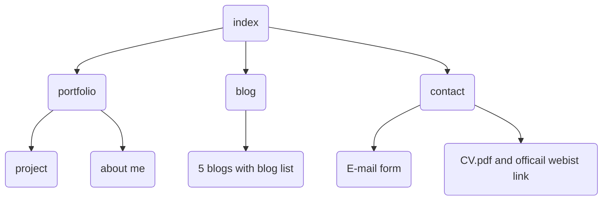
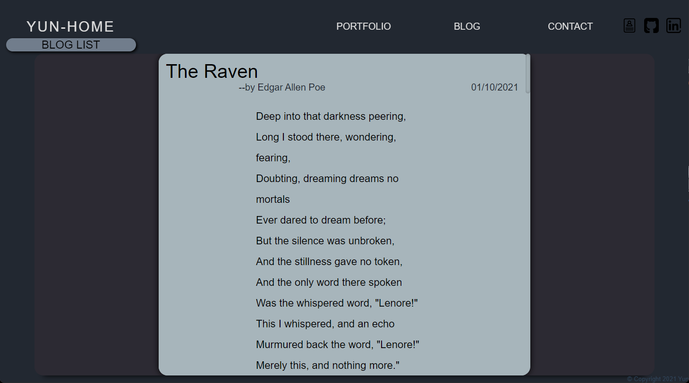

# Portfolio Website
This is my ***[Portfolio website](http://google.com)*** , Link is ***[http://google.com](http://google.com)***.

***[GitHub repository](https://github.com/sam-lee-py/Portfolio)***  for this website is ***[https://github.com/sam-lee-py/Portfolio](https://github.com/sam-lee-py/Portfolio)***.

## Purpose
This website is used to show my work **porfoliov, previous experience, hobbies** and some **blogs**.

## Functionality / Features
This website is deveoped by ***HTML and CSS***.

#### Contains 4 HTML page:
- idex page
- portfolio page
- blog page
- contact page

#### Color use:
- ```#DDDDDD```
- ```#222831```
- ```#30475E```
- ```#F05454```
- ```#222831```
- ```#717d8c```
- ```#a7b5bb```

#### Icon use:
- 
- 
- 
- 
- 

All the animation in this website use CSS animation. For example,
```css
    animation: logo-tracking 10s infinite;

    @keyframes logo-tracking {
    0% {letter-spacing: -0.5em; filter: blur(6px);}
    25% {letter-spacing: 0.1em; filter: blur(0px);}
    75% {letter-spacing: 0.1em; filter: blur(0px);}
    100% {letter-spacing: -0.5em; filter: blur(6px);}
}
```

## Sitemap
Here is the Sitemap for this websit:


### Target audience
This website target audience is for the **cooperater** and **employer**.

### Screenshots
- **Index page**
    
- **Portfolio page**
    
- **Blog page**
    
- **Contact page**
    

### Tech stack
#### HTML
Hypertext Markup Language (HTML) is used for structuring and placing content. 
#### CSS
Cascading Style Sheets (CSS) determines how the content displays. It controls colors, fonts, layout, etc. 